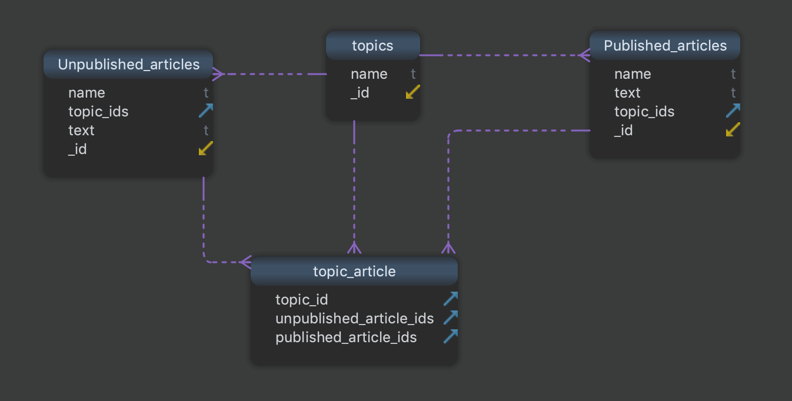

**Problem Statement**

You have articles collection and topic collections. Each topic is associated with one or more
articles(published or non published both). The ratio of all topics in database to the ratio of all
articles in database is ~1/10000.

An article can be published. The ratio of articles which get published is ~1/1000.
This published article will have topics associated with it.

Queries:
1. Get all topics which are associated with a published article.
2. Get all articles associated with a topic.
Design a Schema for the above requirements.
You can choose either a SQL or NoSQL database but NoSQL DB will be preferred.

**Possible Solution**

Here we have 4 collections,
 
 unpublished and published articles have a very high ratio and since the app will be likely to query published articles frequently, we can take this as a separate collection.
 
 Now a large of articles will be mapped to topics, so if we store article ids in topic collection, our general query of retrieving topic will be slow.
 
 So here we have to do normalization and we keep a mapping as a separate collection.
This is causing data redundancy but overall our general queries will not be affected by this.

Getting all topics associated with an article will be easy because no. of topics is very less.

To get all articles associated with a topic, we take the topic_id , then we query in the mapping collection and from that we obtain an array of ids.
We can do the next query on published and unpublished articles now.